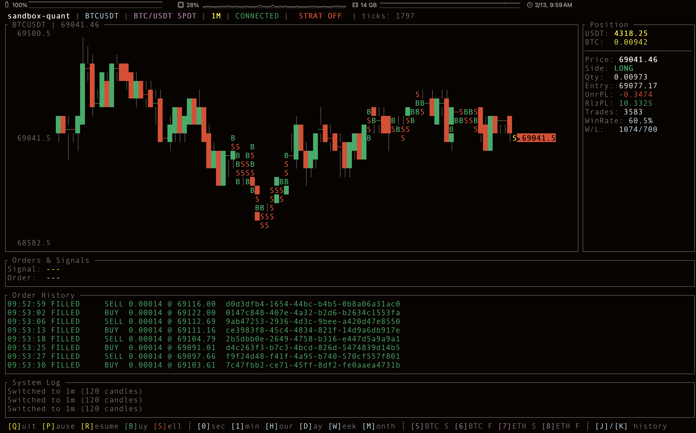

# sandbox-quant

<p align="center">
  <b>Rust-native Binance/Alpaca paper trading prototype</b><br/>
  Moving Average Crossover strategy + real-time stream + terminal dashboard
</p>

<p align="center">
  
  
  
</p>

> [!WARNING]
> Testnet only. Do not use real mainnet API keys.

## What This Project Does

- Streams market ticks from Binance (WebSocket) or Alpaca (polling)
- Generates MA crossover signals (fast/slow SMA)
- Places and tracks paper orders through REST
- Renders position, pnl, and event flow in terminal UI
- Logs structured JSON to `sandbox-quant.log`

## Architecture

```text
WS Task ──tick──> Strategy Task ──signal──> Order Manager
    │                                           │
    │         (all send AppEvent)               │
    └──MarketTick──> app_event_rx <──OrderUpdate─┘
                         │
                    TUI Main Loop (ratatui)
```

## Quick Start

1. Clone and enter the repo
   ```bash
   cd sandbox-quant
   ```
2. Create env file
   ```bash
   cp .env.example .env
   ```
3. Fill API keys in `.env` (based on selected broker)
   ```bash
   BINANCE_API_KEY=your_testnet_api_key_here
   BINANCE_API_SECRET=your_testnet_api_secret_here
   APCA_API_KEY_ID=your_alpaca_paper_key_here
   APCA_API_SECRET_KEY=your_alpaca_paper_secret_here
   ```
4. Build and run
   ```bash
   cargo build --release
   cargo run --release
   ```

## Runtime Configuration

Edit `config/default.toml`:

```toml
broker = "binance" # binance | alpaca

[binance]
product = "btc_spot"  # btc_spot | btc_future | eth_spot | eth_future
rest_base_url = "https://demo-api.binance.com"
ws_base_url = "wss://demo-stream.binance.com/ws"
recv_window = 5000
kline_interval = "1m"

[alpaca]
asset_class = "us_equity" # us_equity | us_option | us_future
symbol = "AAPL"
symbols = ["AAPL", "GLD", "SLV"] # gold/silver ETF included
kline_interval = "1m"
trading_base_url = "https://paper-api.alpaca.markets"
data_base_url = "https://data.alpaca.markets"

[strategy]
fast_period = 10
slow_period = 30
order_amount_usdt = 10.0
min_ticks_between_signals = 50

[ui]
refresh_rate_ms = 100
price_history_len = 120
```

## CLI Verification Screenshot

Below is a captured CLI screenshot from a real `cargo run` execution on **2026-02-13 (PST)**.

- Command used:
  ```bash
  (cd /tmp && cargo run --manifest-path /Users/yuksehyun/project/sandbox-quant/Cargo.toml)
  ```
- Why `/tmp`: run-path verification without local `config/default.toml` so the binary starts and exits predictably.



Full raw output is saved at `docs/assets/cargo-run-output.txt`.

## Dashboard Keys

- `Q`: Graceful shutdown
- `P`: Pause strategy
- `R`: Resume strategy
- `B`: Manual buy
- `S`: Manual sell
- `T`: Product selector
- `N`: Next Alpaca symbol (`AAPL` -> `GLD` -> `SLV`)
- `V`: Previous Alpaca symbol

## Logs

```bash
tail -f sandbox-quant.log | jq .
```

## Build Artifact Size

If `target/` grows too large during local iteration, see:

- `docs/target-size-analysis.md`

## Project Layout

```text
sandbox-quant/
├── Cargo.toml
├── .env.example
├── config/default.toml
├── docs/assets/
│   └── cargo-run-output.txt
├── docs/img/
│   └── app-screenshot.png
├── src/
│   ├── main.rs
│   ├── config.rs
│   ├── error.rs
│   ├── event.rs
│   ├── order_manager.rs
│   ├── binance/
│   ├── indicator/
│   ├── model/
│   ├── strategy/
│   └── ui/
└── TESTING.md
```

## Testing

```bash
cargo test
cargo test -- --ignored
```

Reference: `TESTING.md`
