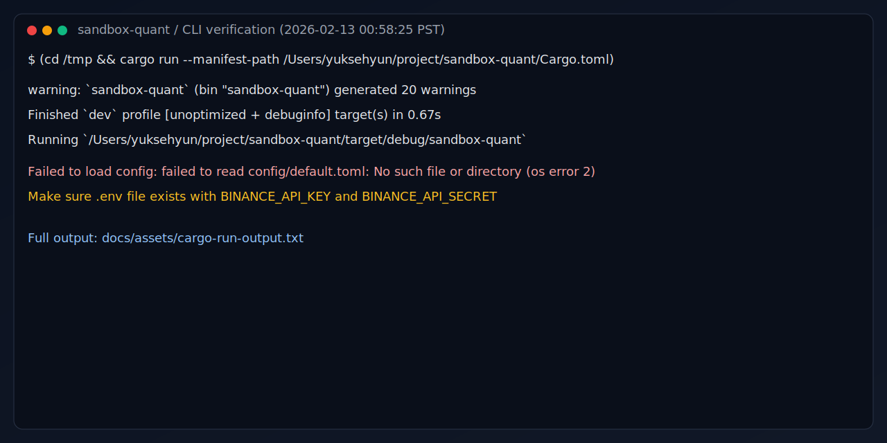

# sandbox-quant

<p align="center">
  <b>Rust-native Binance Spot Testnet trading prototype</b><br/>
  Moving Average Crossover strategy + real-time stream + terminal dashboard
</p>

<p align="center">
  
  
  
</p>

> [!WARNING]
> Testnet only. Do not use real mainnet API keys.

## What This Project Does

- Streams market ticks from Binance Spot Testnet WebSocket
- Generates MA crossover signals (fast/slow SMA)
- Places and tracks orders through REST
- Renders position, pnl, and event flow in terminal UI
- Logs structured JSON to `sandbox-quant.log`

## Architecture

```text
WS Task ──tick──> Strategy Task ──signal──> Order Manager
    │                                           │
    │         (all send AppEvent)               │
    └──MarketTick──> app_event_rx <──OrderUpdate─┘
                         │
                    TUI Main Loop (ratatui)
```

## Quick Start

1. Clone and enter the repo
   ```bash
   cd sandbox-quant
   ```
2. Create env file
   ```bash
   cp .env.example .env
   ```
3. Fill testnet keys in `.env`
   ```bash
   BINANCE_API_KEY=your_testnet_api_key_here
   BINANCE_API_SECRET=your_testnet_api_secret_here
   ```
4. Build and run
   ```bash
   cargo build --release
   cargo run --release
   ```

## Runtime Configuration

Edit `config/default.toml`:

```toml
[binance]
rest_base_url = "https://testnet.binance.vision"
ws_base_url = "wss://testnet.binance.vision/ws"
symbol = "BTCUSDT"
recv_window = 5000
kline_interval = "1m"

[strategy]
fast_period = 10
slow_period = 30
order_amount_usdt = 10.0
min_ticks_between_signals = 50

[ui]
refresh_rate_ms = 100
price_history_len = 120
```

## CLI Verification Screenshot

Below is a captured CLI screenshot from a real `cargo run` execution on **2026-02-13 (PST)**.

- Command used:
  ```bash
  (cd /tmp && cargo run --manifest-path /Users/yuksehyun/project/sandbox-quant/Cargo.toml)
  ```
- Why `/tmp`: run-path verification without local `config/default.toml` so the binary starts and exits predictably.



Full raw output is saved at `docs/assets/cargo-run-output.txt`.

## Dashboard Keys

- `Q`: Graceful shutdown
- `P`: Pause strategy
- `R`: Resume strategy

## Logs

```bash
tail -f sandbox-quant.log | jq .
```

## Project Layout

```text
sandbox-quant/
├── Cargo.toml
├── .env.example
├── config/default.toml
├── docs/assets/
│   ├── cargo-run-cli.svg
│   └── cargo-run-output.txt
├── src/
│   ├── main.rs
│   ├── config.rs
│   ├── error.rs
│   ├── event.rs
│   ├── order_manager.rs
│   ├── binance/
│   ├── indicator/
│   ├── model/
│   ├── strategy/
│   └── ui/
└── TESTING.md
```

## Testing

```bash
cargo test
cargo test -- --ignored
```

<<<<<<< HEAD
Reference: `TESTING.md`

## Automation (Hourly)

This repository includes a scheduled GitHub Actions workflow:

- `.github/workflows/periodic-maintenance.yml`

What it does every hour:

- Runs `cargo fmt --all` and opens a PR if formatting changes are found
- Bumps crate patch version in `Cargo.toml` (e.g. `0.1.0` -> `0.1.1`)
- Runs `cargo clippy --workspace --all-targets --all-features -- -D warnings`
- Runs `cargo test --workspace --all-targets --all-features`
- Opens (or updates) a health-check issue when clippy/tests fail

You can also run it manually with `workflow_dispatch` from the Actions tab.

## Hourly Exchange/Product PR Automation

This repository also includes an hourly scheduler for expanding demo venue coverage:

- `.github/workflows/hourly-market-catalog-pr.yml`

What it does every hour:

- Runs `scripts/validate_market_catalog.sh` to fail early on malformed catalog data
- Runs `scripts/hourly_market_update.sh`
- Adds the next not-yet-registered exchange/product candidate from `data/demo_market_backlog.csv`
- Updates `data/demo_market_registry.csv` and `docs/hourly-market-catalog.md`
- Opens a PR from a fresh branch `chore/hourly-market-catalog/<run_id>`
Reference: `TESTING.md`

## Multi-Broker Demo Probe (Stocks/Options)

To validate non-crypto paper/sandbox venues before full adapter work, run:

```bash
cargo run --bin demo_broker_probe
```

Environment variables:

- `ALPACA_PAPER_API_KEY`, `ALPACA_PAPER_API_SECRET`
- `TRADIER_SANDBOX_TOKEN`

Optional endpoint overrides:

- `ALPACA_PAPER_BASE_URL` (default: `https://paper-api.alpaca.markets`)
- `TRADIER_SANDBOX_BASE_URL` (default: `https://sandbox.tradier.com/v1`)

See `docs/multi-broker-demo-integration.md` for scope and roadmap.
