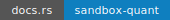
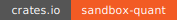
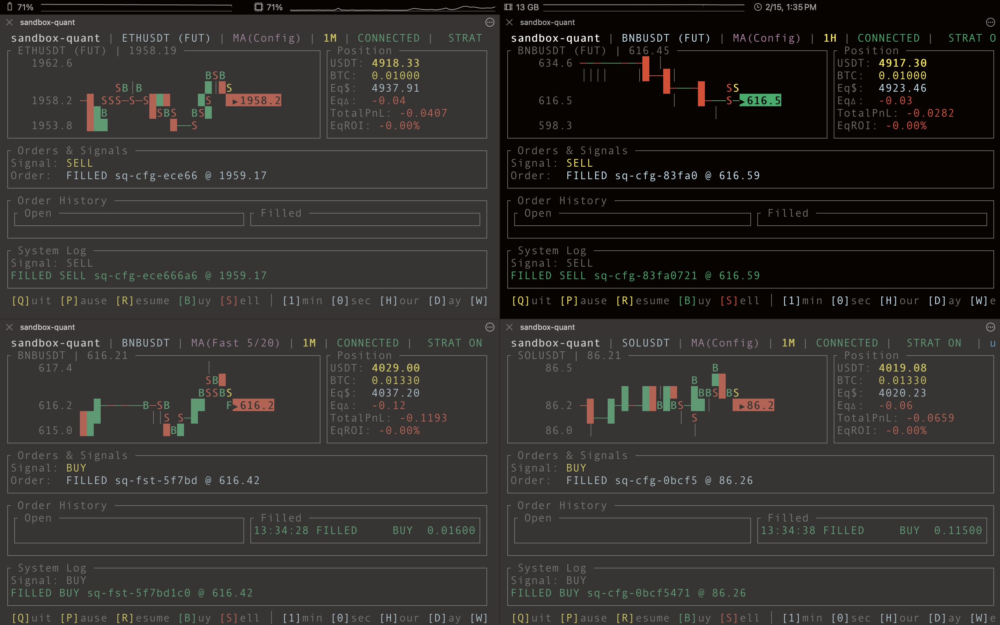
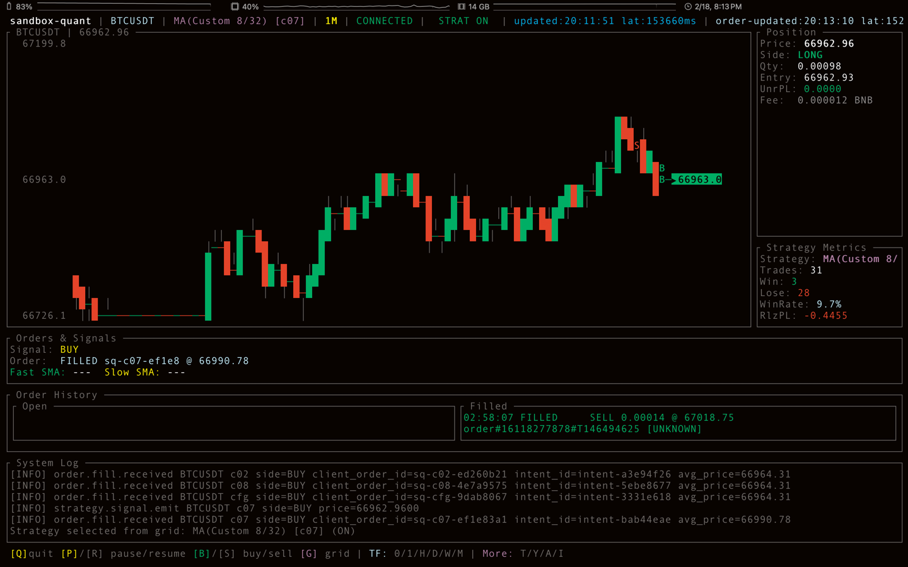
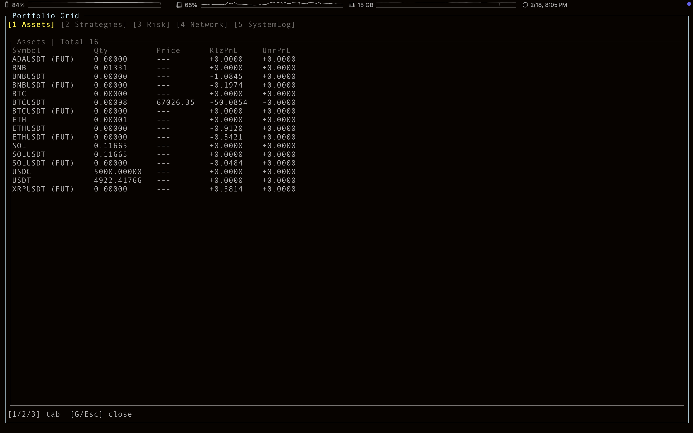
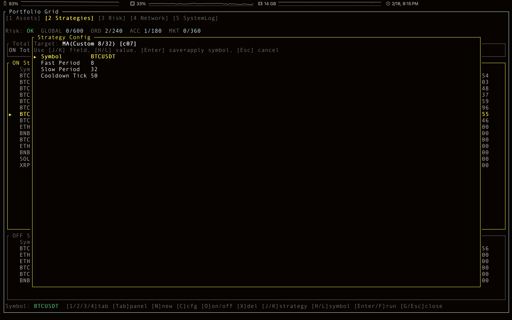
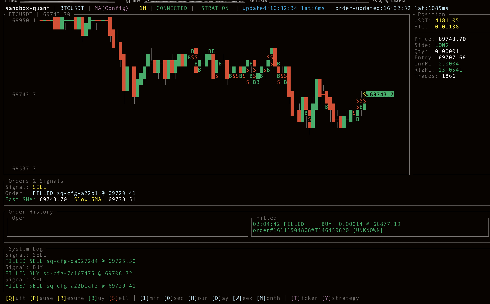

# sandbox-quant

[](https://docs.rs/sandbox-quant)
[](https://crates.io/crates/sandbox-quant)

Terminal-based Rust trading sandbox for Binance Spot Testnet.

It provides real-time market streaming, strategy-driven order execution, cumulative trade history, and a `ratatui` dashboard for monitoring positions and performance.

## What Is sandbox-quant?



- Real-time market + strategy loop (WebSocket + REST)
- Multi-view terminal dashboard (chart, positions, orders, history, logs)
- Persistent history with SQLite and incremental recovery
- Per-strategy and manual-performance attribution (`W/L/T/PnL`)
- Fill markers and strategy-aware UI telemetry
- Operational safeguards for time sync and rate-limit pressure

## Quick Start

1. Create `.env`:

```bash
cp .env.example .env
```

2. Set Binance Spot Testnet credentials:

```bash
BINANCE_API_KEY=your_testnet_api_key_here
BINANCE_API_SECRET=your_testnet_api_secret_here
```

3. Run app:

```bash
cargo run --bin sandbox-quant
```

## Key Controls

| Area | Keys | Description |
|---|---|---|
| App | `Q` | Quit |
| Strategy Runtime | `P` / `R` | Pause / Resume |
| Manual Orders | `B` / `S` | Manual Buy / Sell |
| Selector | `T` / `Y` | Open Symbol / Strategy Selector |
| Timeframe | `0/1/H/D/W/M` | `1s/1m/1h/1d/1w/1M` |
| Grid | `G` | Open/Close Portfolio Grid |

## Strategy Status

Current strategy implementation status (code-based):

| Strategy | Category | Status | Source | Test | Doc |
|---|---|---|---|---|---|
| MA Crossover | Trend | [x] Implemented | [src/strategy/ma_crossover.rs](src/strategy/ma_crossover.rs) | [tests/ma_crossover_tests.rs](tests/ma_crossover_tests.rs) | [docs/strategy/ma-crossover.md](docs/strategy/ma-crossover.md) |
| EMA Crossover | Trend | [x] Implemented | [src/strategy/ema_crossover.rs](src/strategy/ema_crossover.rs) | [tests/ema_crossover_tests.rs](tests/ema_crossover_tests.rs) | [docs/strategy/ema-crossover.md](docs/strategy/ema-crossover.md) |
| ATR Expansion | Volatility | [x] Implemented | [src/strategy/atr_expansion.rs](src/strategy/atr_expansion.rs) | [tests/atr_expansion_tests.rs](tests/atr_expansion_tests.rs) | [docs/strategy/atr-expansion.md](docs/strategy/atr-expansion.md) |
| Channel Breakout | Breakout | [x] Implemented | [src/strategy/channel_breakout.rs](src/strategy/channel_breakout.rs) | [tests/channel_breakout_tests.rs](tests/channel_breakout_tests.rs) | [docs/strategy/channel-breakout.md](docs/strategy/channel-breakout.md) |
| RSA | Hybrid | [x] Implemented | [src/strategy/rsa.rs](src/strategy/rsa.rs) | [tests/rsa_strategy_tests.rs](tests/rsa_strategy_tests.rs) | [docs/strategy/rsa.md](docs/strategy/rsa.md) |
| Donchian Trend | Trend | [x] Implemented | [src/strategy/donchian_trend.rs](src/strategy/donchian_trend.rs) | [tests/donchian_trend_tests.rs](tests/donchian_trend_tests.rs) | [docs/strategy/donchian-trend.md](docs/strategy/donchian-trend.md) |
| MA Reversion | MeanReversion | [x] Implemented | [src/strategy/ma_reversion.rs](src/strategy/ma_reversion.rs) | [tests/ma_reversion_tests.rs](tests/ma_reversion_tests.rs) | [docs/strategy/ma-reversion.md](docs/strategy/ma-reversion.md) |
| Bollinger Reversion | MeanReversion | [x] Implemented | [src/strategy/bollinger_reversion.rs](src/strategy/bollinger_reversion.rs) | [tests/bollinger_reversion_tests.rs](tests/bollinger_reversion_tests.rs) | [docs/strategy/bollinger-reversion.md](docs/strategy/bollinger-reversion.md) |
| Stochastic Reversion | MeanReversion | [x] Implemented | [src/strategy/stochastic_reversion.rs](src/strategy/stochastic_reversion.rs) | [tests/stochastic_reversion_tests.rs](tests/stochastic_reversion_tests.rs) | [docs/strategy/stochastic-reversion.md](docs/strategy/stochastic-reversion.md) |
| Volatility Compression | Volatility | [ ] Planned | - | - | - |
| Opening Range Breakout | Breakout | [ ] Planned | - | - | - |
| Regime Switch | Hybrid | [ ] Planned | - | - | - |
| Ensemble Vote | Hybrid | [ ] Planned | - | - | - |

## UI Overview

- **Main Dashboard**: Live chart view with active position summary, strategy metrics, and runtime logs.


- **Portfolio Grid - Assets Tab**: Consolidated asset balances, position quantities, and realized/unrealized PnL.


- **Portfolio Grid - Strategies Tab**: ON/OFF strategy panels with per-strategy stats (`W/L/T/PnL`) and running time.


- **Portfolio Grid - Strategies + Config Popup**: Strategy configuration editor for symbol and parameter tuning.


- **Portfolio Grid - Network Tab**: Operational network health panel (latency, drop rates, reconnect signals).


- **Account Popup**: Quick account balance overview for available assets and quote holdings.


<!-- UI_DOCS:END -->

## Configuration

Edit `config/default.toml` for runtime behavior.

Common knobs:
- Strategy parameters (`fast/slow/cooldown`)
- Order sizing and risk limits
- Default symbols and market behavior

## Documentation Links

- API Docs (`docs.rs`): https://docs.rs/sandbox-quant
- Crate Page (`crates.io`): https://crates.io/crates/sandbox-quant
- Strategy Docs Index: [docs/strategy/README.md](docs/strategy/README.md)
- Markdown Book (`docs-site`):

```bash
cargo install mdbook
mdbook serve docs-site --open
```

- Rustdoc local:

```bash
cargo doc --no-deps --open
```

## Development Workflow

Useful commands:

```bash
cargo test -q
```

Testing references:
- `TESTING.md`
- `tests/`

## AI PR Policy

- Gemini-assisted PR workflow: `.github/workflows/gemini-pr.yml`
- Review and safety guide: `GEMINI.md`
- Gemini automation lane is limited to RFC/issue proposal docs (no runtime strategy code generation).

## Appendix: Run Capture

Terminal screenshot from a real run:



Captured raw output:
- `docs/assets/cargo-run-output.txt`

Note:
- This is a TUI app. Running in non-interactive output redirection contexts can fail terminal initialization.
- For normal usage, run directly in an interactive terminal.
