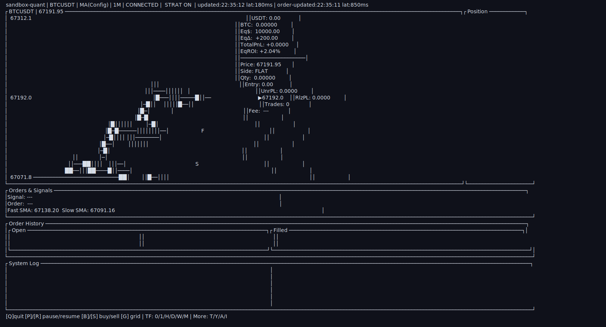
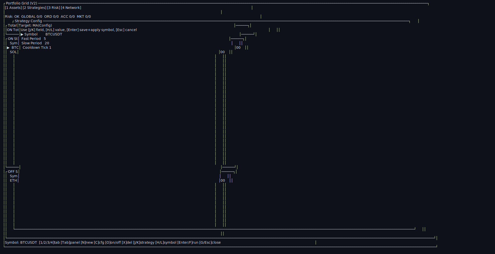
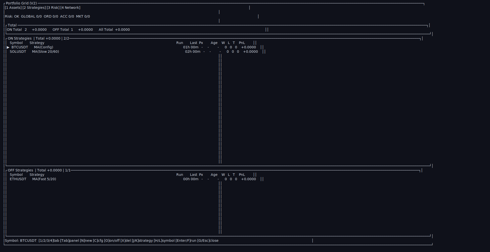

# sandbox-quant

Terminal-based Rust trading sandbox for Binance Spot Testnet.

It provides real-time market streaming, strategy-driven order execution, cumulative trade history, and a `ratatui` dashboard for monitoring positions and performance.

## What Is sandbox-quant?


- Real-time market + strategy loop (WebSocket + REST)
- Multi-view terminal dashboard (chart, positions, orders, history, logs)
- Persistent history with SQLite and incremental recovery
- Per-strategy and manual-performance attribution (`W/L/T/PnL`)
- Fill markers and strategy-aware UI telemetry
- Operational safeguards for time sync and rate-limit pressure

## Quick Start

1. Create `.env`:

```bash
cp .env.example .env
```

2. Set Binance Spot Testnet credentials:

```bash
BINANCE_API_KEY=your_testnet_api_key_here
BINANCE_API_SECRET=your_testnet_api_secret_here
```

3. Run app:

```bash
cargo run --bin sandbox-quant
```

## Key Controls

| Area | Keys | Description |
|---|---|---|
| App | `Q` | Quit |
| Strategy Runtime | `P` / `R` | Pause / Resume |
| Manual Orders | `B` / `S` | Manual Buy / Sell |
| Selector | `T` / `Y` | Open Symbol / Strategy Selector |
| Timeframe | `0/1/H/D/W/M` | `1s/1m/1h/1d/1w/1M` |
| Grid | `G` | Open/Close Portfolio Grid |

## UI Overview

<!-- UI_DOCS:START -->
### UI Docs (Auto)

- Generated by `cargo run --bin ui_docs -- smoke|full`
- Full index: `docs/ui/INDEX.md`



- Main Dashboard raw: `docs/ui/screenshots/dashboard-main.txt`


- Portfolio Grid - Assets Tab raw: `docs/ui/screenshots/grid-assets.txt`


- Portfolio Grid - Strategies + Config Popup raw: `docs/ui/screenshots/grid-strategies-config.txt`


- Portfolio Grid - Strategies Tab raw: `docs/ui/screenshots/grid-strategies.txt`

<!-- UI_DOCS:END -->

## Configuration

Edit `config/default.toml` for runtime behavior.

Common knobs:
- Strategy parameters (`fast/slow/cooldown`)
- Order sizing and risk limits
- Default symbols and market behavior

## Documentation Links

- API Docs (`docs.rs`): https://docs.rs/sandbox-quant
- Markdown Book (`docs-site`):

```bash
cargo install mdbook
mdbook serve docs-site --open
```

- Rustdoc local:

```bash
cargo doc --no-deps --open
```

## Development Workflow

Useful commands:

```bash
cargo test -q
cargo run --bin ui-docs
cargo run --bin ui_docs -- scenario grid-network
```

Testing references:
- `TESTING.md`
- `tests/`

## Appendix: Run Capture

Terminal screenshot from a real run:


Captured raw output:
- `docs/assets/cargo-run-output.txt`

Note:
- This is a TUI app. Running in non-interactive output redirection contexts can fail terminal initialization.
- For normal usage, run directly in an interactive terminal.
