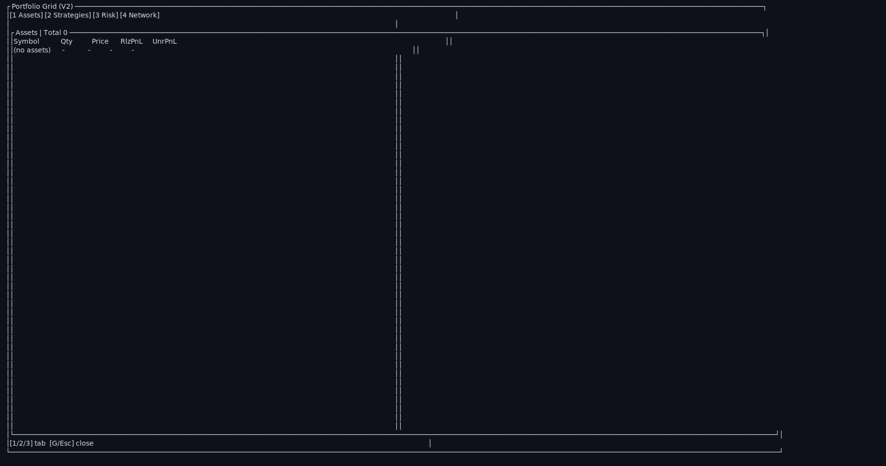

# UI Snapshot Index

Generated by `cargo run --bin ui_docs -- <mode>`.

## Main Dashboard (`dashboard-main`)

- raw: `docs/ui/screenshots/dashboard-main.txt`

## Portfolio Grid - Assets Tab (`grid-assets`)

- raw: `docs/ui/screenshots/grid-assets.txt`

## Portfolio Grid - Strategies + Config Popup (`grid-strategies-config`)

- raw: `docs/ui/screenshots/grid-strategies-config.txt`

## Portfolio Grid - Strategies Tab (`grid-strategies`)

- raw: `docs/ui/screenshots/grid-strategies.txt`

## Portfolio Grid - Network Tab (`grid-network`)

- raw: `docs/ui/screenshots/grid-network.txt`

## Account Popup (`popup-account`)

- raw: `docs/ui/screenshots/popup-account.txt`

