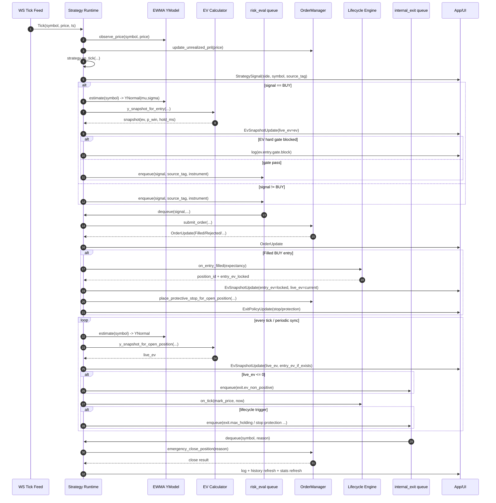

# RFC 0039: 현재 매수→청산 사이클 (Signal + YModel + EV + Exit) 실행 흐름

- Status: Draft
- Author: sandbox-quant
- Date: 2026-02-25
- Related:
  - `docs/rfcs/0038-y-price-model-split-spot-futures-ev.md`
  - `docs/rfcs/0035-ev-time-variance-vs-entry-lock.md`
  - `docs/rfcs/0033-close-all-progress-and-confirmation-ux.md`

## 1. 목적

현재 코드 기준으로 실제 런타임에서
- 전략 시그널이 언제 생성되고
- YModel(`mu`,`sigma`)이 어떻게 갱신/추정되며
- EV 게이트/주문/체결/청산이 어떻게 연결되는지
를 단일 문서로 명확히 정리한다.

## 2. 범위

- 대상: `main` 런타임의 전략 태스크
- 시장: Spot + Futures
- EV: Y-normal 기반 `LiveEV` + 진입시 고정 `EntryEV`

## 3. 핵심 구성요소

1. Strategy Runtime
- profile별 strategy가 tick마다 `Signal(Buy/Sell/Hold)` 생성

2. YModel (Online)
- tick 유입 시 instrument별 가격 관측
- EWMA로 `YNormal(mu, sigma)` 추정

3. EV Engine
- Spot/Futures 분기 손익함수로 `EV`, `EV_std`, `p_win` 산출

4. Risk / Order
- EV 게이트 통과 후 risk_eval queue
- `OrderManager::submit_order` 실행

5. Lifecycle / Exit
- 체결 시 `EntryEV` 잠금
- 보유 중 tick 및 주기 sync에서 `LiveEV` 재평가
- `EV <= 0` 또는 lifecycle trigger 시 내부 청산 큐로 전파

## 4. Mermaid: End-to-End Sequence

## 5. 상태 정의

1. Signal 생성 단계
- 입력: 시장 tick + strategy 내부 상태
- 출력: `StrategySignal`

2. Entry 평가 단계
- 입력: `signal=BUY`, `YNormal(mu,sigma)`, market type
- 처리: `y_snapshot_for_entry` -> EV gate
- 출력: risk_eval enqueue 또는 block log

3. 주문/체결 단계
- 처리: risk check + exchange submit
- 체결 시: lifecycle 진입 상태 생성 + `EntryEV` 잠금

4. 보유/청산 단계
- 처리: `LiveEV` 주기 갱신, lifecycle trigger 감시
- 종료 조건:
  - `LiveEV <= 0`
  - max holding trigger
  - protective stop 관련 정책 trigger
  - 수동/close-all 경로

## 6. EntryEV vs LiveEV (현재 동작)

- `EntryEV`
  - BUY entry fill 시점에 고정 저장
  - 이후 EV 업데이트 시 `entry_ev`가 비어 있어도 이전값 유지

- `LiveEV`
  - tick/sync마다 YModel 추정값으로 재계산
  - 운영 의사결정(게이트/청산)에 사용

## 7. Spot/Futures 분기

- Spot:
  - `spot_ev_from_y_normal`
  - 비용: fee/slippage/borrow

- Futures:
  - `futures_ev_from_y_normal`
  - 비용: fee/slippage/funding/liq_risk
  - 계약승수 `multiplier` 반영

## 8. 주요 로그/이벤트 체크포인트

- `strategy.signal.emit`
- `ev.signal.snapshot` / `ev.entry.gate.block`
- `lifecycle.entry`
- `ev.exit.zero`
- `Close ALL positions ...` 관련 progress 이벤트

## 9. 운영 점검 체크리스트

1. tick 유입 시 YModel 관측이 누락되지 않는가
2. BUY 전 EV 스냅샷과 gate 판단이 항상 동반되는가
3. 체결 시 `EntryEV`가 잠기고 이후 유지되는가
4. `LiveEV <= 0` 시 내부 청산 큐로 실제 전파되는가
5. UI 표시에 `live_ev/entry_ev`가 구분 저장되는가

## 10. Open Items

1. `confidence`를 게이트에 어떻게 반영할지 (현재는 초안)
2. `funding`, `liq_risk` 실시간 추정 연결 범위
3. EWMA 파라미터 자동 튜닝 여부
